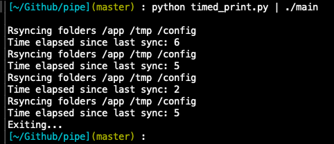

A program to show updates when a program prints the same thing the screen again and again.

For example `vagrant rsync-auto` prints the same thing to the output whenever some file changes on the host system. It is difficult to understand if the file has been synced already just by looking at the output.

When piping the output of `vagrant rsync-auto` to the program like `vagrant rsync-auto | ./main` it will print the time elapsed since something was printed to the stdout.

